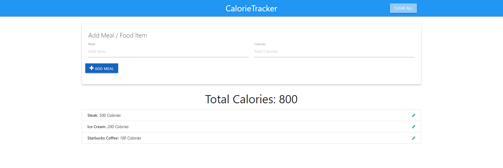

# CalorieTracker
Created using pure JavaScript to add all fundamentals into one project.

## References
This project is based on the udemy course "Modern JavaScript From The Beginning" by Brad Traversy. In his course, he explains JS fundamentals, and finishes each chapter with a hands-on project.
